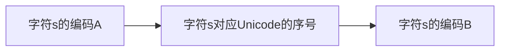

# 1. 二进制--计算机表示数据的方式
### 1.1 十进制表示数的方式
1. 以123来说，使用十进制表示可以写为:<br/>

$$
123 = 1 \times 10 ^2 + 2 \times 10 ^1 + 3 \times 10 ^ 0
$$

2. 按照类比规则推算，N进制数字abc有如下表示，其中k为位权：

$$
abc_{(N)} = a \times k^m + b \times k^{m-1} + c \times k^{m-2} + ...
$$

### 1.2 二进制的数字表示
二进制的位权为2，基本数字只有0和1，整好符合计算机的高低电平。因此十进制数4可以表示为:

$$
4_{(10)} = 1 \times 2^2 + 0 \times 2^1 + 0 \times 2^0 = 100_{(2)}
$$
十进制的负数只需要在数字前面加上负号就表示负数了，而二进制的负数与十进制类似，在最高添加一个符号为，1表示负数，0表示整数，每种类型的数据都是最左边的一位。但负数实际上不是简单的给最高位设置符号。例如：
1. -1的8位二进制按概念应是10000001，实际上为11111111
2. -127的8位二进制按概念应是11111111，实际上为10000001，因此我们需要注意下列计算机表示二进制的机器码。
- 原码：符合我们==日常逻辑的编码==为原码：例如1的8位原码为<u>00000001</u>;
- 反码：在==原码的基础上按位取反==为反码：例如<u>00000001</u>的反码为<u>11111110</u>;
- 补码：在==反码的基础上再加1==就为补码：例如<u>00000001</u>的补码为<u>11111111</u>;

使用补码表示是因为计算机只会计算加法，通过补码的表示计算机能够通过加法做减法运算。

### 1.3 十六进制--二进制的简化
由于二进制书写不方便，加上越大的数，二进制越长，因此使用16进制来替代二进制。十六进制的数字分别为(0~9、A[10]、B[11]、C[12]、D[13]、E[14]和F[15])

二进制 | 十进制 | 十六进制 | 二进制 | 十进制 | 十六进制
:---:|:---:|:---:|:---:|:---:|:---:
1010 | 10 | A | 1011 | 11 | B
1100 | 12 | C| 1101 | 13 | D
1110 | 14 | E | 1111 | 15 | F

##### 1.4 位运算
1. 左移(<<)：左移一位表示乘以2（高位舍去，右侧补0）；
2. 右移(>>)：右移一位表示除以2（低位舍去，高位按原先补充）；

##### 1.5 查看浮点数的具体二进制形式

```java
Integer.toBinaryString(Float.floatToIntBits(value));
Long.toBinaryString(Double.doubleToLongBits(value));
```
# 2. 字符集与编码
##### 2.1 非Unicode编码
1. **ASCII：**覆盖键盘上的绝大多数的字符，对美国等英语国家够用；
2. **ISO 8859-1：** 在ASCII码的基础上对支持的字符集进行了扩展，新增了西欧字符；
3. **Windows-1252：**在ISO 8859-1的基础上新增了欧元以及其他的符号，用途广泛；
4. **GB2312：**简体中文编码规范，使用两个字节表示汉字；
5. **GBK：**GB2312的扩充，支持更多的汉字编码；
6. **GB18030：**在GBK的基础上扩充更多汉字编码以及中日韩统一字符，使用2~4个字节表示字符；
7. **Big5：**针对繁体中文编码，用于中国香港、中国澳门和中国台湾地区；

##### 2.2 Unicode编码
为全世界的字符进行统一编码，它没有规定编码如何对应二进制表示。常用的字符二进制编码方案有如下几种：
1. UTF-32：字符编号的整数二进制形式，4字节
2. UTF-16：变长字节表示，编号在U+0000\~U+FFFF使用两字节；编号在U+10000\~U+10FFFF使用四字节。使用U+D800~U+DBFF的就是4字节，否则为2字节；
3. UTF-8：依旧使用变长字节表示，每个字符使用的字节个数与Unicode编号的大小有关；

##### 2.3 编码转换
1. 假设字符需要从编码A转换为编码B，那么首先需要知道字符所对应的编码A的格式，通过编码A的Unicode字符映射表找到其Unicode编号，然后通过Unicode编号再查找编码B的映射表。


编码转换实际上只是改变了字符的二进制内容，但并没有改变字符看上去的样子。

2. 乱码的原因：要么是字符在不同的语言环境对应不同编码导致，要么是字符在错误的编码下又再次进行了转码导致无法恢复。
3. 乱码的解决：第一种情况比较简单，只需要换成对应的编码即可重新查看，第二种情况就是对错误的编码进行逆向操作，从而达到恢复原先编码的问题。
4. 使用Java恢复乱码：

```java
String str = "value to encdoe";
String newStr = new String(str.getBytes("Windows-1252"), "GB18030");
System.out.println(newStr);
```